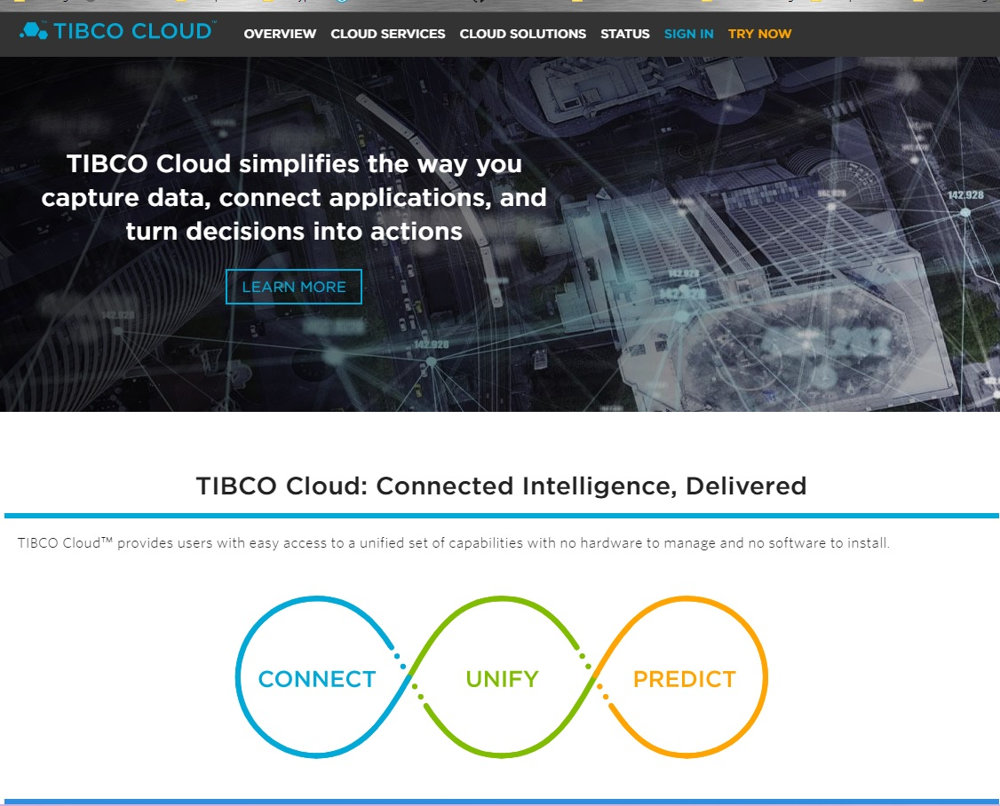
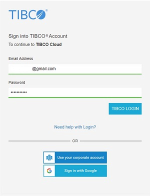
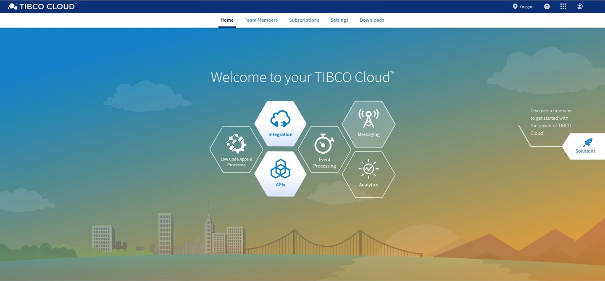

# 1. Validate Your Environment #

In this section, you'll validate your lab environment, which consists of a client machine and a TIBCO Cloud Integration trial environment.

## 1.1 Sign in to Your AWS Instance ##

### 1.1.1 Getting Ready ###

In order for you to do the labs, we've prepared an Amazon Machine Image (AMI), which has all prerequisite software - besides TIBCO Cloud Integration - installed, and that you can access via Remote Desktop. Details of the AMI will be distributed during the workshop.

| Participant       | URL                                 | Username/Password |
| ----------------- | ----------------------------------- | ----------------- |
| john.doe@acme.com | xxx.eu-west-1.compute.amazonaws.com | username/password |

### 1.1.2 See Also ###

Besides TIBCO Cloud Integration, the following software will be used:

* [TIBCO Business Studio™ for BusinessWorks™](https://integration.cloud.tibco.com/docs/getstarted/installation/installing-studio.html?_ga=2.126013197.1661410125.1557311514-1465520282.1557311514)
* [Postman](https://www.getpostman.com/downloads/)

## 1.2 Sign in to TIBCO Cloud ##

### 1.2.1 Getting Ready ###

This lab assumes you have started a trial of TIBCO Cloud™ Integration (If you haven't, [click here](https://www.tibco.com/products/tibco-cloud-integration/sign-up?_ga=2.96144156.1661410125.1557311514-1465520282.1557311514) and choose the United States as a region).

### 1.2.2 How to Do It ###

1. Browse to [https://cloud.tibco.com/](https://cloud.tibco.com/).

    
2. Click **SIGN IN** (at the right top), and fill out the relevant account details (**Email Address** and **Password**) in the following screen.

    
3. After this, you should see a landing page which looks similar to this:

    

## 1.3 What's Next ##

[Design an API and Create a Mock Application](001.md)
