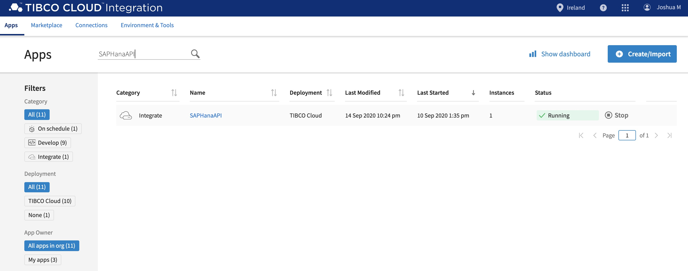

# 3. Build and Deploy Your API #

In this section we will demo how to push an app implemented in BusinessWorks from Business Studio to TIBCO Cloud. Functionally, the app implements a system API that gets purchase orders from SAP Hana.

After that you'll create a Flogo app that implements a process API that creates sales orders, by first invoking the system API that gets a purchase order from SAP Hana, then invoking a system API that gets contact details from Salesforce, and finally creates a sales order by invoking a system API for SAP ERP.

* BusinessWorks Apps in TIBCO Cloud Integration
    * Connect Business Studio to TIBCO Cloud
    * Import a Project in to Business Studio
    * Push the Project to TIBCO Cloud and Test It
* Flogo Apps in TIBCO Cloud Integration
    * Create the Skeleton Flogo App from the API Specification
    * Implement the Flogo App
    * Push the Flogo App to TIBCO Cloud and Test It

## 3.1 BusinessWorks Apps in TIBCO Cloud Integration (demo) ##

In this lab, you'll first connect TIBCO Business Studio™ for BusinessWorks from your workstation to TIBCO Cloud. You'll then import a BusinessWorks project into Business Studio that implements a system API that gets purchase orders from SAP Hana. Finally, you'll push the BusinessWorks app to TIBCO Cloud and test it.

### 3.1.1 Getting Ready ###

To get ready, open TIBCO Business Studio™ for BusinessWorks. Assuming you start with a clean enviroment, your screen should look similar to this:


### 3.1.2 How to Do It: Connect Business Studio to TIBCO Cloud ###

To setup a connection from TIBCO Business Studio™ for BusinessWorks to TIBCO Cloud that enables you to push an app to the cloud directly from TIBCO Business Studio, do the following:

1. Go to API Explorer, click the down arrow in the upper right corner, and click Settings.

    

2. In the **Configure API Settings** form, click the **New** button. Fill out the **URL** and your TIBCO Cloud Integration username and password in the new form.

    | Field         | Value           |
    | ------------- | --------------- |
    | URL           | `https://integration.cloud.tibco.com:443` |
    | Username      | `your@email.com` |
    | Password      | `YoUrPassWoRd`   |

    Your screen should look like this:

    

3. Click the **Finish** button when your done, and click the **Close** button in the **Configure API Settings** form. The API Explorer should look like this:

    

### 3.1.3 How to Do It: Import a Project in to Business Studio ###

To import a BusinessWorks project into Business Studio that implements a system API, do the following:

1. From the menu, select **File > Import**. In the new form, select **General > Existing Studio Projects into Workspace**.

2. Select the [`tci_workshop_stubs.zip`](../src/bw_projects/tci_workshop_stubs.zip) file from the [`src/bw_projects`](../src/bw_projects) directory. Your screen should look like this:

    

3. Click the **Finish** button. The Project Explorer should look like this:

    

### 3.1.4 How to Do It: Push the Project to TIBCO Cloud and Test It ###

To push the SAP Hana system API app to TIBCO Cloud, do the following:

1. In the Project Explorer, select **SAPHanaAPI > Push to Cloud ...**:

    

2. Navigate to TIBCO Cloud, and once the app has been successfully pushed, your screen should look like this:

    


    *Alternative for when you don't have TIBCO Business Studio installed on your system*
    You can import my [`SAPHanaAPI_1.0.0.ear`](../src/bw_projects/SAPHanaAPI_1.0.0.ear) and [`manifest.json`](../src/bw_projects/manifest.json) file from the [`src/bw_projects`](../src/bw_projects) directory. 
    
    In the https://integration.cloud.tibco.com/applications screen choose import and select BusinessWorks
    
    
    In the next screen click upload and select both the ear and json files.
    
    
    
    Then press the import button.

3. Once the **SAPHanaAPI** app is running, hover over the **Endpoint** link, and select **View and Test** from the menu

4. Test the **SAPHanaAPI** app by filling out a value in the **orderId** field, and clicking on the **Try it out!** button:

    

5. Copy the URL, which has a pattern like `https://integration.cloud.tibcoapps.com:443/xxxxx/PurchaseOrders/purchaseOrders/{orderId}`, and store it somewhere. You will need it when you implement the process API in the next lab.

## 3.2 Flogo Apps in TIBCO Cloud Integration ##

In this lab you'll implement a process API that creates sales orders, by first invoking the system API that gets a purchase order from SAP Hana, then invoking a system API that gets contact details from Salesforce, and finally creates a sales order by invoking a system API for SAP ERP.

You will first create a "skeleton" Flogo app from the **SalesOrders** API specification. Then you will implement the flow with the 3 system API calls, to finally push the Flogo app and test it.

### 3.2.1 Getting Ready ###

To be able to create the "skeleton" Flogo app from the **SalesOrders** API specification, do the following:

1. Navigate to the API specifications by clicking on the **API Specs** menu item.
2. Select the group you've created the **SalesOrders** API specification in, e.g. **MyTCIWorkshop**.
3. Your screen should look similar to:

    

### 3.2.2 How to Do It: Create the Skeleton Flogo App ###

To create a "skeleton" Flogo app from on the **SalesOrders** API specification, do the following:

1. Navigate to the API specifications by clicking on the **Apps** menu item (or follow https://integration.cloud.tibco.com/applications).
        
2. Create a Flogo app by clicking on the **Create** button, select **Flogo** and click the **Create New App** button
 
    
 
3. You can rename your created flogo app to **sales_orders_1_0_flogo_app**

    
    
 
### 3.2.3 How to Do It: Implement the Flogo App ###

In this lab, you'll create a process API that creates sales orders by making 3 system API calls. The address of first system API call is the URL of the BusinessWorks app you have pushed and tested in the previous lab. The adresses of the other API calls are from apps we have already deployed, and their URLs are specified below.

To implement the process API, do the following:

1. Create a new skeleton flow by clicking Create.
   
   

2. Fill in the name **postSync_orderId_POST** and click Create.

   

3. Click on the plus button on the left of the screen to add a new trigger.

   

4. Search for the **Receive HTTP Message** trigger and click it to continue

   
  
5. Configure your trigger as in the screenshot below. Use **/sync/{orderId}** in Resource Path. Click Continue. In the next screen choose option "Just add the trigger".

   

6. To enable data to flow between the trigger and the flow, you first need to map the trigger output to the flow input, and flow data to the trigger reply. Click on the  icon to open the configuration of the **ReceiveHTTPMessage** trigger.

7. Map the trigger output to the flow input as follows:

    

8. Map the flow data to the trigger reply as follows:

    

9. Close the trigger configuration screen, and move the **Return** tile at least 3 positions to the right. Create a first activity, by clicking on the left-most `+` and navigate through **General > Invoke REST Service**. Configure this activity as follows:

    1. Give it a name: **GetPurchaseOrder**.
    2. In the **Settings** section, specify the following fields:

        | Field         | Value           |
        | ------------- | --------------- |
        | Method  | GET |
        | URL | `https://integration.cloud.tibcoapps.com:443/xxxxx/PurchaseOrders/purchaseOrders/{orderId}` |
        | Use certificate for verification | `false` |

       **Note**: Do not copy-and-paste the URL from the above table. Use the URL you copied in the previous lab, when you tested the purchase order API.

    3. In the **Input** section, create the following mapping:

        | Activity Input | Upstream Output |
        | -------------  | --------------- |
        | `pathParams.orderId` | `$flow.pathParams.orderId` |

    4. In the **Output Settings** section, ensure the **Response Type** is set to `application/json`, and copy the following json structure into the **Response Schema**:

        ```json
        {
            "d": {
                "CreationDate": "/Date(1472774400000)/",
                "CreatedByUser": "CB9980000027",
                "DistributionChannel": "10",
                "OverallSDProcessStatus": "20",
                "OverallTotalDeliveryStatus": "B",
                "SalesDistrict": " ",
                "SoldToParty": "17100001",
                "TotalNetAmount": "353.50",
                "TransactionCurrency": "USD",
                "SalesOrderType": "OR",
                "CustomerPurchaseOrderDate": "/Date(1472774400000)/",
                "OverallSDDocumentRejectionSts": "A",
                "ShippingCondition": "01",
                "IncotermsTransferLocation": "Palo Alto",
                "IncotermsVersion": " ",
                "SalesOrderDate": "/Date(1472774400000)/",
                "HeaderBillingBlockReason": " ",
                "SalesGroup": " ",
                "SalesOrder": "2",
                "ShippingType": " ",
                "IncotermsLocation2": " ",
                "DeliveryBlockReason": " ",
                "IncotermsLocation1": "Palo Alto",
                "AssignmentReference": " ",
                "OrganizationDivision": "00",
                "PurchaseOrderByCustomer": "John::Fisher::jfisher@acme.com",
                "SalesOrganization": "1710",
                "IncotermsClassification": "123",
                "SalesOffice": " ",
                "TotalCreditCheckStatus": " ",
                "CustomerPurchaseOrderType": "123",
                "PricingDate": "/Date(1472774400000)/",
                "CustomerPaymentTerms": "0004",
                "LastChangeDate": "/Date(1472774400000)/",
                "SDDocumentReason": " ",
                "RequestedDeliveryDate": "/Date(1472774400000)/",
                "PaymentMethod": " ",
                "LastChangeDateTime": "/Date(1472774400000)/"
            }
        }
        ```

10. Close the activity configuration screen, and create a second activity, by clicking on the next `+` and navigate through **General > Invoke REST Service**. Configure this activity as follows:

    1. Give it a name: **GetContact**.
    2. In the **Settings** section, specify the following fields:

        | Field         | Value           |
        | ------------- | --------------- |
        | Method  | GET |
        | URL | `https://eu-west-1.integration.cloud.tibcoapps.com:443/wwkyrltl6iamrpcttjy5rwhpvsjklai5/Contacts/contacts` |
        | Use certificate for verification | `false` |

    3. In the **Input Settings** section, add rows for the following query parameters and save each of them:

        | Parameter Name | Type |
        | -------------  | --------------- |
        | firstName | string |
        | lastName | string |
        | email | string |

    4. In the **Input** section, create the following mapping:

        | Activity Input | Upstream Output |
        | -------------  | --------------- |
        | `queryParams.firstName` | `string.substringBefore($activity[GetPurchaseOrder].responseBody.d.PurchaseOrderByCustomer, "::")` |
        | `queryParams.lastName` | `string.substringBefore(string.substringAfter($activity[GetPurchaseOrder].responseBody.d.PurchaseOrderByCustomer, "::"), "::")` |
        | `queryParams.email` | `string.substringAfter(string.substringAfter($activity[GetPurchaseOrder].responseBody.d.PurchaseOrderByCustomer, "::"), "::")` |

    5. In the **Output Settings** section, ensure the **Response Type** is set to `application/json`, and copy the following json structure into the **Response Schema**:

        ```json
        {
            "firstName": "John",
            "lastName": "Fisher",
            "mobile": "1231231234",
            "email": "jfisher@acme.com",
            "mailingStreet": "431 Chestnut Street",
            "mailingCity": "Philadelphia",
            "mailingState": "PA",
            "mailingPostalCode": "19150"
        }
        ```

11. Close the sctivity configuration screen, and create a third activity, by clicking on the next `+` and navigate through **General > Invoke REST Service**. Configure this activity as follows:

    1. Give it a name: **PostSalesOrder**.
    2. In the **Settings** section, specify the following fields:

        | Field         | Value           |
        | ------------- | --------------- |
        | Method  | POST |
        | URL | `https://eu-west-1.integration.cloud.tibcoapps.com:443/qyf5nyddmoz2oh5iloh5wc6yru4qwtn7/Orders/orders` |
        | Use certificate for verification | `false` |

    3. In the **Input Settings** section, copy the following json structure into the **Request Schema**:

        ```json
        {
            "Email": "jfisher@acme.com",
            "firstName": "John",
            "item": "1",
            "lastName": "Fisher",
            "phone": "1231231234",
            "price": "353.50"
        }
        ```

    4. In the **Input** section, create the following mapping:

        | Activity Input | Upstream Output |
        | -------------  | --------------- |
        | `body.Email` | `$activity[GetContact].responseBody.email` |
        | `body.firstName` | `$activity[GetContact].responseBody.firstName` |
        | `body.item` | `"1"` |
        | `body.lastName` | `$activity[GetContact].responseBody.lastName` |
        | `body.phone` | `$activity[GetContact].responseBody.mobile` |
        | `body.price` | `$activity[GetPurchaseOrder].responseBody.d.TotalNetAmount` |

    5. In the **Output Settings** section, ensure the **Response Type** is set to `application/json`, and copy the following json structure into the **Response Schema**:

        ```json
        {
            "_response_string": "Sales Order has been created with SalesDocumentID 000013572"
        }
        ```

12. Close the activity configuration screen, and configure the **Return** activity as follows:

    1. In the **Input** section, create the following mapping:

        | Activity Input | Upstream Output |
        | -------------  | --------------- |
        | `code` | `200` |
        | `responseBody.body` | `$activity[PostSalesOrder].responseBody` |

13. Close the activity configuration screen. Your flow looks something like:

    

### 3.2.4 How to Do It: Push the Flogo App to TIBCO Cloud and Test It ###

To push the Flogo app and test it, do the following:

1. Click the **Push app** button.

2. Once the **salesorders_1_0_flogo_app** app is running, hover over the **Endpoint** link, and select **View and Test** from the menu

3. Test the **salesorders_1_0_flogo_app** app by filling out a value in the **orderId** field, and clicking on the **Try it out!** button.

## 3.3 See Also ##

**BusinessWorks (Cloud Integration)**

* [TIBCO Cloud Integration: Getting Started with BusinessWorks Applications](https://community.tibco.com/wiki/tibco-cloud-integration-getting-started-businessworks-applications)
* [TIBCO Business Studio™ - Cloud Edition](https://integration.cloud.tibco.com/docs/bw/index.html)
* [TIBCO ActiveMatrix BusinessWorks™ Plug-ins](https://integration.cloud.tibco.com/docs/connectors/index.html)
* [TIBCO® Cloud Integration Frequently Asked Questions](https://community.tibco.com/wiki/tibcor-cloud-integration-frequently-asked-questions)

**Flogo (Cloud Integration)**

* [TIBCO Cloud Integration: Getting Started with Flogo](https://community.tibco.com/wiki/tibco-cloud-integration-getting-started-flogo)
* [TIBCO Flogo® apps](https://integration.cloud.tibco.com/docs/flogo/index.html)
* [TIBCO Flogo® Connectors](https://integration.cloud.tibco.com/docs/flogo_connectors/index.html)

**Project Flogo**

* [Project Flogo™ Community Wiki](https://community.tibco.com/wiki/project-flogo-community-wiki)
* [Project Flogo](http://www.flogo.io/)
* [Project Flogo Documentation](https://tibcosoftware.github.io/flogo/)
* [Project Flogo Github Repos](https://github.com/project-flogo)

## 3.4 What's Next ##

[Distribute & Manage your API](003.md)
