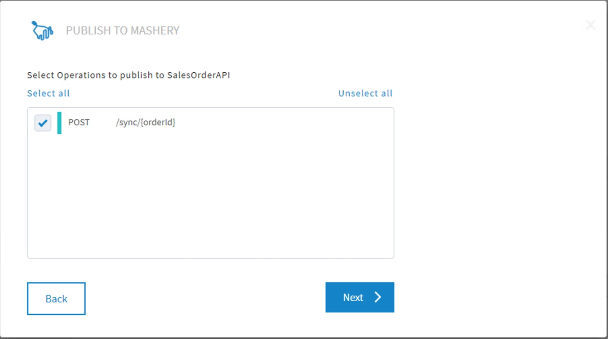
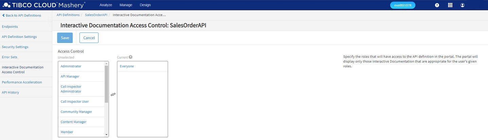

# 4. Distribute & Manage your API #

In this section you'll turn the SalesOrder API into a managed API by publishing it to Mashery. Within the Integration section of TIBCO Cloud, you will first publish an API endpoint to Mashery, specifying its API definition, API package and API plan. Then you will adjust the API definition and API package from within the APIs section of TIBCO Cloud, so you can create an application and register for an API key, and can adjust the interactive documentation of the API. After that, you will create an application, register for an API key, and then test the API with Postman, using the API key. Finally, you will create interactive documentation for the API, using a Open API Swagger specification, and then test the API from that documentation.

* Publish your API to Mashery
* Configure the API Definitions & API Packages
* Register an Application for an API Key
* Test the API using Postman
* Create Interactive Documentation

## 4.1 Publish your API to Mashery ##

### 4.1.1 Getting Ready ###

This lab assumes you've already navigated to the Flogo apps in the Integration capability, and can see the **salesorders_1_0_flogo_app** running so your screen looks something like this:


### 4.1.2 How to Do It ###

To publish the **SalesOrder** API to Mashery, do the following:

1. Hover over the **Endpoint** link, and select **Publish to Mashery** from the menu:

    

2. Select the traffic manager domain in the next form (**Note**: the name of the selected traffic manager domain should match the pattern below, i.e. **evalxxxxxx.api.mashery.com**), and click **Next**:

    

3. Create a new API definition by clicking on the **+ New definition** link in the next form. Give the definition a name, e.g. **SalesOrderAPI**, and click on the **Create** button.

    

4. Select the **SalesOrderAPI**

    

5. Select the operation **POST /sync/{orderId}** to publish to the **SalesOrderAPI**, and click **Next**:

    

6. Create a package (click the **Create Package** button), give it a name, e.g. **SalesOrderPackage**, and click the **Create** button:

    

7. Select the **SalesOrderPackage**, create a plan (by clicking the **Create a plan** button), give it a name, e.g. **BasePlan**, and click the **Create** button (**Note**: ensure that the **Allow self-provisioning keys** box is checked):

    

   Click **Done** when everything completed successfully:

   

## 4.2 Configure the API Definitions & API Packages ##

Now that you have published the SalesOrder API to Mashery from within the Integration section TIBCO Cloud, you will adjust the configuration of the API definition and the API package on the APIs section of TIBCO Cloud.

### 4.2.1 Getting Ready ###

In order to able to configure the API definitions and the API packages, you need to navigate to the control center as follows:

1. Navigate to the APIs section:

    

2. Click on **Control Center** so your screen looks like this:

    

### 4.2.1 How to Do It ###

You will first adjust the configuration of the API definition of the SalesOrder API.

1. From the top menu bar, first select **Design > APIs**,

    

    and then select **SalesOrderAPI**, so your screen looks like this:

    

2. Select the **Endpoints** section on the left of the screen (if it is not already selected), and copy and save the URL in the **Public Domains** column from the **salesorders_1_0_flogo_app__sync_orderId** record, which should match the following pattern:

    `http://evalxxxxxx.api.mashery.com/nnnnnnnnnnnnnnnnnnnnnnnnnnnnnnnn/sync/{orderId}`

    You will need the **host** part (i.e. **evalxxxxxx.api.mashery.com**) and the **base path** part (i.e. **/nnnnnnnnnnnnnnnnnnnnnnnnnnnnnnnn**) of this URL later in lab 4.4.

3. Select the **Interactive Documentation Access Control** section on the left of the screen, select **Everyone**, and click the blue **Save** button.

    

4. Select the **Endpoints** section on the left of the screen again, and click on **salesorders_1_0_flogo_app__sync_orderId**. Select the **Key & Method Detection** on the left of the screen, and review the values, and in particular those of the **Developer's API Key Location** and the **Key Field Identifier** fields:

    

Now you'll adjust the API Package, changing the **BasePlan** that is part of the SalesOrder API package.

1. From the top menu bar, first select **Design > Packages**,

    

    and then select **SalesOrderPackage > BasePlan**, so your screen looks like this:

    

2. Select the **Key Properties** section on the left of the screen and increase the **Number of Keys allowed until Moderation** to **4**, and click the blue **Save** button:

    

3. Select the **Rate Limits** on the left of the screen and review the default **Throttle**, **Quota**, and **Quota Period** settings, leaving the values as in the following screen.

    

4. Select the **Access Control** section on the left of the screen, select **Everyone**, and click the blue **Save** button.

    

## 4.3 Register an Application for an API Key ##

In the lab, you will create and register an application for the managed SalesOrder API.

### 4.3.1 How to Do It ###

In order to register for an API key, do the following:

1. Navigate to the APIs section:

    

2. Click on **Developer Portal** so your screen looks like this:

    

3. From the top menu, click on **My Account**, and click on **Applications** in the next screen.

    

4. Click the **Create a New Application** button, and specify the following values in the next form:

    | Name | Value |
    | ---- | ----- |
    | Name of your application | SalesOrderApp |
    | Web Site | `http://www.mycompany.com` |

    Ensure that the **Issue a new key for SalesOrderPackage** and **I agree to the terms of service** are checked, and **BasePlan** is selected. Then click the **Register Application** button.

    

5. Copy and save the API key from the next screen (**Application Registered!**)

    

6. To verify that the API key is enabled, click on **Dashboard** in the top menu. In the next screen, select **Manage > Package Keys** from the top menu bar

    

    and verify that the API key is enabled.

    

    If the key is not enabled, select the API key, change the **Status** to **Enabled**, and save the changes.

## 4.4 Test the API using Postman ##

In this lab, you'll first edit and save a Swagger specification for the managed SalesOrder API, and then import it into Postman so you can test the managed API using the API key.

### 4.4.1 How to Do It ###

1. Open the [`src/mashery/SalesOrders.json`](../src/mashery/SalesOrders.json) file, and save it as `SalesOrders-Mashery.json`. In the new file, replace the values for **host** and **basePath**, with the **host** part (i.e. **evalxxxxxx.api.mashery.com**) and the **base path** part (i.e. **/nnnnnnnnnnnnnnnnnnnnnnnnnnnnnnnn**) of the public domain URL of the managed API saved in lab 4.2:

    ```json
      ...
      "host": "evalxxxxxx.api.mashery.com",
      ...
      "basePath": "/nnnnnnnnnnnnnnnnnnnnnnnnnnnnnnnn"
      ...
    ```

    Save the file.

2. Start Postman, and import the `SalesOrders-Mashery.json` file:

    

3. Select the request from the **SalesOrderAPI**. Copy the API key to the value of the **api_key** query parameter, and press the **Send** button. If everything goes well, the result should look something like this:

    

## 4.5 Create Interactive Documentation ##

In this lab, you'll use the adjusted Swagger specification from the previous lab to create interactive documentation for the managed SalesOrder API.

### 4.5.1 How to Do It ###

1. Navigate to the **Control Center**. From the top menu bar, first select **Design > Interactive Documentation**,

    

    and then click the **Create your first Interactive Documentation** button.

2. In the following form, select the **SalesOrderAPI** for the API Definition, select **Swagger** for the format of the document you are uploading, and choose the `SalesOrder-Mashery.json` from the filesystem as the JSON file to upload.

    

    Click on the **Save and Continue** button.

3. In the following screen, select **Enabled** (if needed), and click the **Save** button.

    

4. Navigate to the **Developer Portal**, and click on **API Console**. In the new screen, select **SalesOrderAPI**, and click on the **Try it out** button. First click on the **Authorize** button (with the lock icon), and fill out your api key in the value field. Save that value by first clicking on the **Authorize** and then **Close** button.

    

    Fill out the value for the **orderId**, and click the **Execute** button.

    

    If everything goes well, you'll see the same response as in the previous test with Postman.

## 4.6 See Also ##

* [TIBCO Cloud™ Mashery Documentation](https://docs.mashery.com)
* [TIBCO Mashery® Community Wiki](https://community.tibco.com/wiki/tibco-mashery-community-wiki)
